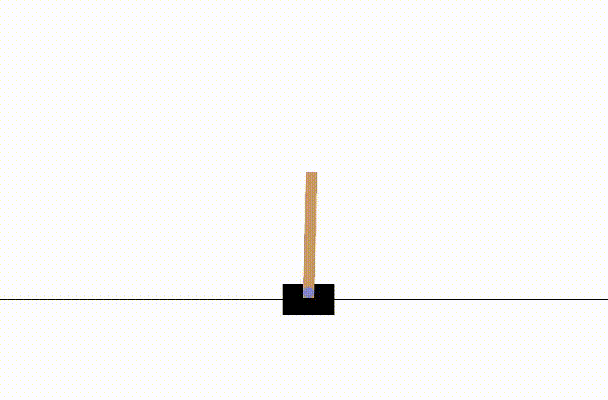
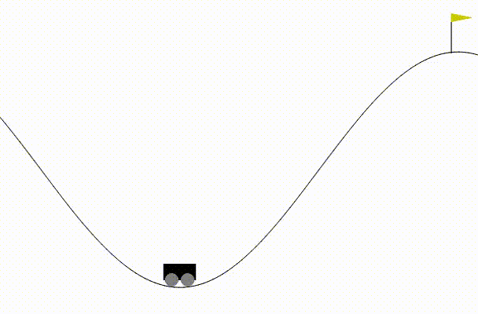

# DQN-RL
Implementation of replay buffer in DQN for improved performance....

### **Deep Q-Network (DQN)**

The **Deep Q-Network (DQN)** extends Q-Learning by combining it with **deep neural networks** and key stabilization techniques. Instead of updating from single, sequential experiences, DQN stores past interactions in a **replay buffer**, allowing it to sample random mini-batches for training. This reduces correlation between samples and improves learning efficiency. Additionally, DQN introduces a **target network**, a periodically updated copy of the Q-network, which provides more stable target values and prevents harmful feedback loops during training. Together, these innovations enable DQN to handle **high-dimensional, continuous state spaces** such as raw pixel inputs in games like Atari.

### **Advantages over SARSA and Q-Learning**

DQN addresses the major limitations of both SARSA and standard Q-Learning with function approximation. It improves **stability**, **sample efficiency**, and **scalability** by using experience replay and target networks. Unlike SARSA, which learns from the current policy, and Q-Learning, which can become unstable with neural networks, DQN achieves a balance between stability and performance. This makes it capable of learning complex control tasks end-to-end from raw sensory inputs—something traditional SARSA and Q-Learning struggle to achieve reliably.

### CartPole Evaluation

### MountainCar Evaluation

